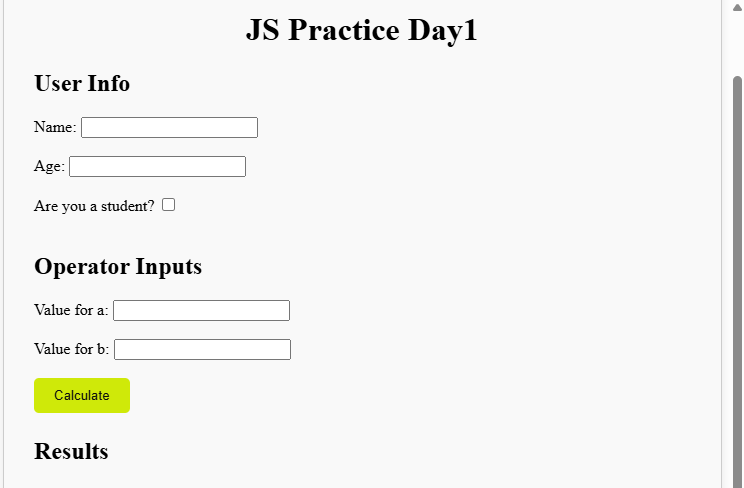
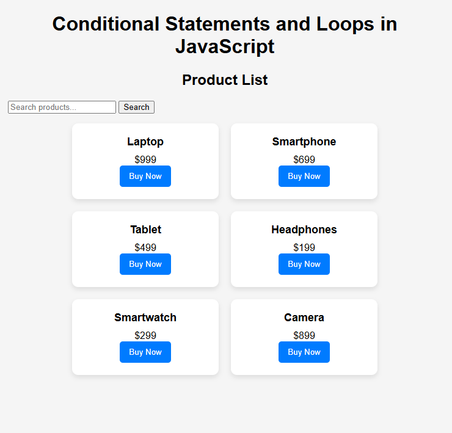

# Analytics_web_development
i'm starting this repo to practice my day to day work related coding and improvements including analytics , web development as a learning journey 
# Day1
It has a JS file and html file which explain and able to test concept of variable and operatiors and there usage with examples.
Html file has a code that uses the function from js file and returns the results to the page . 

# Day2
It has a JS file and html file which explain concept of loops and conditions  there usage with examples.
Html file has a code that can be run which build the dynamic image card looping through  the array .
we can also filter out the particular or matching item from the list of available items: buit  based on the ecomorce PLP pages.
